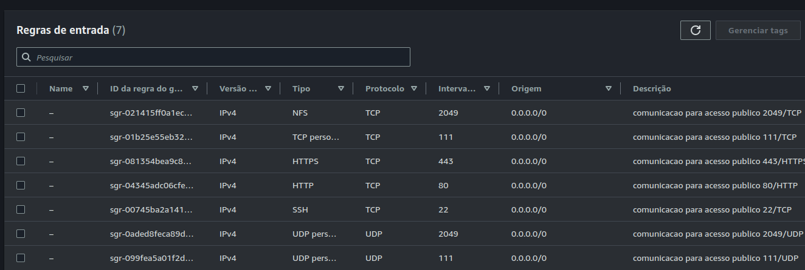
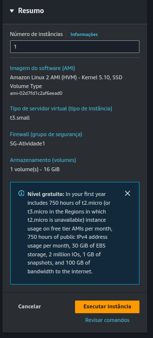

# DOCUMENTAÇÃO DO PROCESSO  DE DESENVOLVIMENTO DA ATIVIDADE 1 - ESTÁGIO COMPASS

## Parte 1 : AWS

### Criar instância EC2

- Security Group com liberação para acesso público 22/TCP, 111/TCP e UDP, 2049/TCP/UDP, 80/TCP, 443/TCP


- Criação ec2 Requisitos: Amazon Linux 2 , família t3.small,  EBS 16GB, Security Group SG-atividade1



## Parte 2 : Linux

### Instalar pacotes

- Execute os comandos:
  
```sudo su -```

`yum update -y`

`yum install httpd -y`

`systemctl enable httpd`

`systemctl start httpd` 

`systemctl status httpd`

### Montar NFS usando serviço EFS

- Pacote sugerido para instalação pela documentação AWS

`amazon-efs-utils`

- Diretório cliente 

`mkdir /mnt/nfs `

- Comando para montar o EFS como NFS

`mount -t nfs4 -o nfsvers=4.1,rsize=1048576,wsize=1048576,hard,timeo=600,retrans=2,noresvport <ip_efs>:/ /mnt/nfs`

- Verificar se o diretório está montado

` df -h -t nfs4 ` 

 - Saída esperada do comando


- Editar arquivo /etc/fstab - Para montar o disco automáticamente ao inicilizar o servidor

`ip_nfs:/ /mnt/nfs nfs4 defaults,_netdev,noresvport   0 0`

### Script

- Criar Diretório do Script.

`mkdir script`

- Script - Deixar script executável para o dono do arquivo.

`chmod u+x script.sh `

- Agendar tarefa no /etc/crontab para executar a cada 5 minutos

`*/5 * * * * root /script/script.sh`
