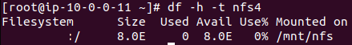

# DOCUMENTAÇÃO DO PROCESSO  DE DESENVOLVIMENTO DA ATIVIDADE 1 - ESTÁGIO COMPASS

## Parte 2 : Linux

### Instalar pacotes

- Execute os comandos:

- Entrar em modo root para executar as configurações:
```
sudo su -
```
- Atualizar o sistema
```
yum update -y
```
- Instalar o servidor Apache
```
yum install httpd -y
```
- Habilitar o apache para subir na inicialização
```
systemctl enable httpd
```
- Iniciar o apache
```
systemctl start httpd
``` 
- Verificar status do apache
```
systemctl status httpd
```

### Montar NFS usando EFS

- Pacote sugerido para instalação pela documentação AWS

```
amazon-efs-utils
```

- Criar diretório de montagem na EC2 cliente 

```
mkdir /mnt/nfs
```

- Comando para montar o EFS como NFS

```
mount -t nfs4 -o nfsvers=4.1,rsize=1048576,wsize=1048576,hard,timeo=600,retrans=2,noresvport <ip_efs>:/ /mnt/nfs
```

- Verificar se o diretório está montado

```
df -h -t nfs4
``` 

 - Saída esperada do comando



- Editar arquivo /etc/fstab - Para montar o disco automáticamente ao inicilizar o servidor

```
ip_efs:/ /mnt/nfs nfs4 nofail,_netdev,rsize=1048576,wsize=1048576,hard,timeo=600,retrans=2,noresvport   0 0
``` 
- Criar diretório dos arquivos de log
```
mkdir /mnt/nfs/adenilson
```

### Script

- Criar Diretório do Script.

```
mkdir /script
```
- Crar o arquivo do script dentro do diretório.
- Dixar script executável para o dono do arquivo, nesse caso será executado como root.

```
chmod u+x script.sh
```

- Agendar tarefa no /etc/crontab para executar a cada 5 minutos
 
```
*/5 * * * * root /script/script.sh
```
